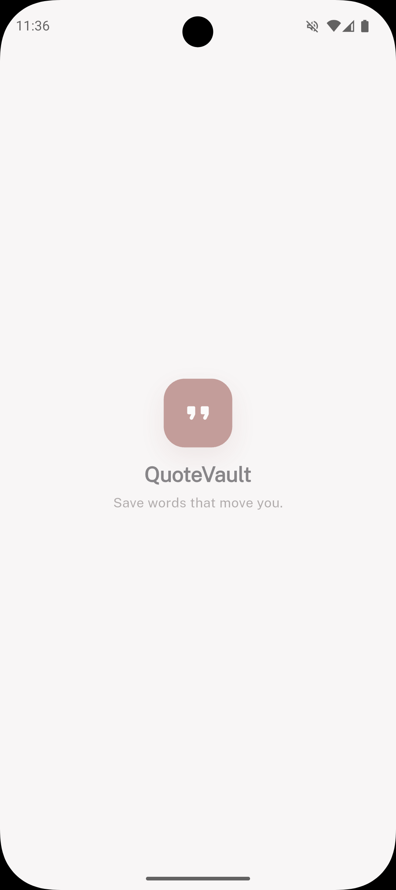
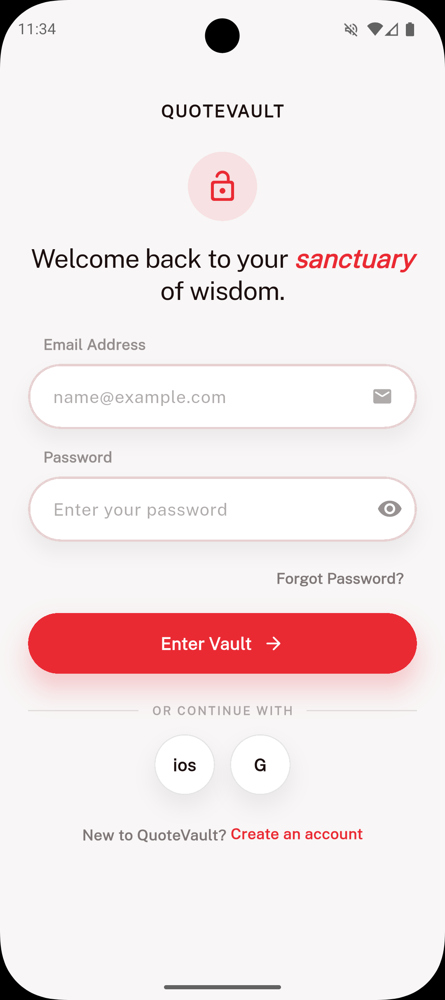
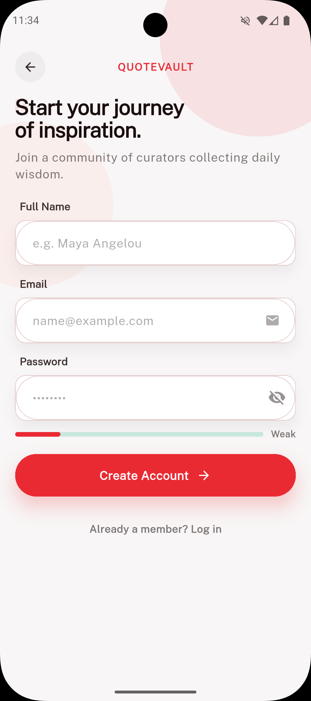
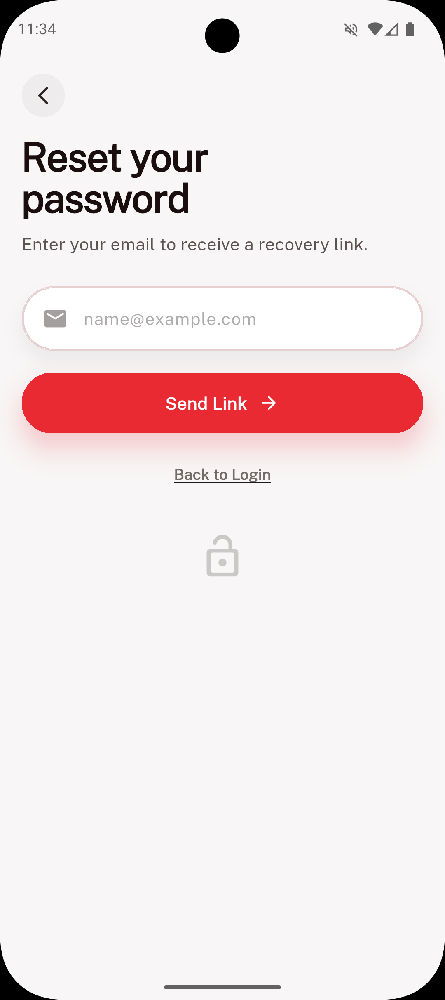

# 📱 QuoteVault — AI Powered Daily Quote App  

QuoteVault is a modern Flutter-based mobile application that helps users discover, save, and organize inspirational quotes.  
The app features secure authentication, cloud sync with **Supabase**, and a clean, minimal UI built with Flutter.

---

## ✨ Features  

- 🔐 **User Authentication** — Login & Signup using Supabase  
- ❤️ **Favorites** — Save your favorite quotes  
- 📂 **Collections** — Organize quotes into custom collections  
- 🔍 **Search & Filter** — Find quotes by category or author  
- ☁️ **Cloud Sync** — All data stored securely in Supabase  
- ⚡ **Fast Performance** — Built with Flutter & Riverpod  
- 🔒 **Secure Database** — Uses Row Level Security (RLS)

---

## 🛠️ Tech Stack  

| Layer | Technology |
|------|------------|
| Frontend | Flutter (Dart) |
| State Management | Riverpod |
| Backend | Supabase |
| Database | PostgreSQL |
| Authentication | Supabase Auth |

## 🛠️ AI Tools Used  

- ChatGPT 5.2 — for code generation, debugging, and architecture planning  
- Stitch — for UI/UX design and prototyping  
- Cursor IDE — for faster AI-assisted coding  

## 🤖 My AI Coding Workflow  

I followed an AI-assisted development approach:

1. Designed the complete UI in Stitch  
2. Used Stitch components (cards, buttons, typography, layout system)  
3. Exported design structure and translated it into Flutter widgets  
4. Used ChatGPT 5.2 to:
   - Generate Flutter UI code  
   - Implement Supabase authentication  
   - Create Riverpod state management  
   - Debug runtime and build errors  
5. Iteratively tested the app on an emulator and refined the UI  


## 🎨 Design (Stitch)  

Stitch Design Link:  
https://stitch.withgoogle.com/projects/491242472699736291

## 🎥 Demo Video

Loom Video: https://vimeo.com/1155124888?share=copy

## App Screenshots







---

## 🚀 Setup Instructions  

### 1️⃣ Clone the repository  
```bash
git clone https://github.com/ayushD-Max/quotevault-app.git
cd quotevault-app
2️⃣ Install dependencies
flutter pub get

3️⃣ Configure Supabase

Add your keys in:

lib/supabase/supabase_keys.dart


Example:

const supabaseUrl = "YOUR_SUPABASE_URL";
const supabaseAnonKey = "YOUR_ANON_KEY";

4️⃣ Run the app
flutter run
